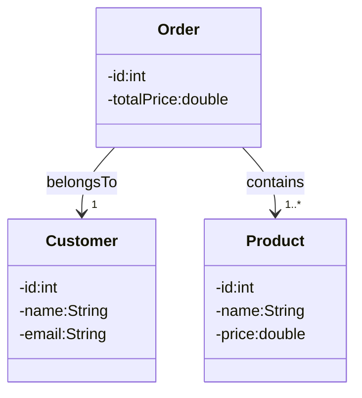

# Workshop — OOP 1 (Online Shop)

## Objectives

Imagine a very simple online store, similar to an online shop you already know, but much smaller and easier to understand.

In this store, a **customer** represents a person who wants to buy something.  
When the customer decides to buy items, they create an **order**.  
An order represents **one purchase made by one customer**.

>**Each order:**
>- Belongs to **exactly one customer**
>- Can contain **one or more products**

A **product** represents an item that can be bought, such as a book or a phone.  
Each product has a **price**.

The main responsibility of the system is to calculate the **total price of an order**.  
This is done by adding together the prices of all products included in that order.

To keep the focus on learning object-oriented concepts, the system includes:
- No database
- No user interface
- No payment handling

---

### Example Scenario

- A customer named **Anna** places an order.
- The order contains **10 products**, for example:
    - Notebook, pen, backpack, water bottle, calculator
    - Headphones, charger, mouse, USB cable, planner
- Each product has its own price.
- The **order** calculates the total price by summing the prices of all products.
- The **order** should also provide a **summary of the ordered products**, for example:
  - How many products are in the order
  - A list of product names (and optionally their prices)
  
Important: In this workshop, the design is **unidirectional**:
- The **order knows which customer it belongs to**
- The **order knows which products it contains**
- The **customer does not store a list of orders**
- The **products do not store a reference back to an order**

---

### Your Task

Your task is to complete and implement the design shown in the **UML class diagram**,  
and apply **encapsulation** and **object relationships** correctly.

Focus on:
- Creating the correct classes
- Defining the correct fields
- Connecting objects using the relationships shown
- Placing logic in the correct class

---

## UML Class Diagram (Conceptual)

---

## Part 2 — (Optional)

Extend the design by improving the system.

- Add one or more classes **or** new fields/methods
- Add relationships that make sense in the scenario
- Explain your design choices:
    - What you added
    - Why you added it
    - How it improves the system
